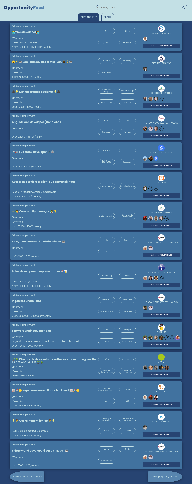

# Opportunity feed

## Project description
In this project I build a really simple application which help to get opportunities from [Torre](https://torre.co),
When you open it, you first see a list of new job opportunities presented on torre.

## Screenshot

[Video presentation](https://www.loom.com/share/53ae7a93896e485ea4f23552a70be581)

## Built with
- [React.js](https://reactjs.org/)
- [Redux](https://redux.js.org/)
- [SASS](https://sass-lang.com/)
- [Ruby on Rails](https://rubyonrails.org/)

## Features
- View list of all opportunities
- View details of one opportunity
- View list of all people
- View details of one person
- Search/filter one record on a given page

## Deployments
- [Live frontend link](https://opportunity-feed.netlify.app/)

- [Backend codes](https://github.com/descholar-ceo/opportunity-feed-backend)

## Running it locally

### Prerequisites

- [NodeJS v14.15.1 or higher](https://nodejs.org/en/)

### Setup
- Clone && checkout the folder: `git clone https://github.com/descholar-ceo/opportunity-feed.git && cd opportunity-feed`

- Install all dependencies: `npm i` or `yarn`

### Usage
- To start the development server: `yarn start` => this should launch the app in your default browser, otherwise access the app on `localhost:3000`

## Acknowledgement (s)
- [Torre](https://torre.co)

## Author

* Github: [descholar-ceo](https://github.com/descholar-ceo)

* Linkedin: [Mugirase Emmanuel](https://linkedin.com/in/mugirase-emmanuel)

* Torre: [Mugirase Emmanuel](https://torre.co/en/emmanuellamugi)
